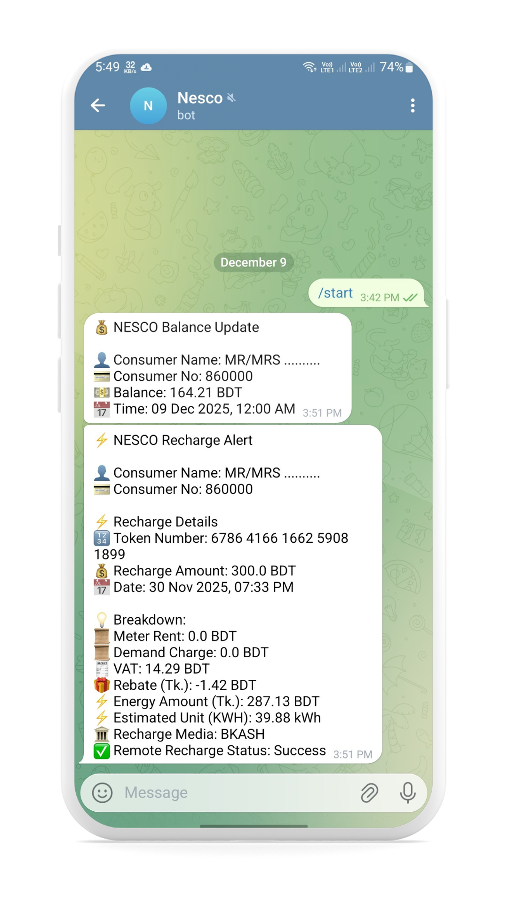
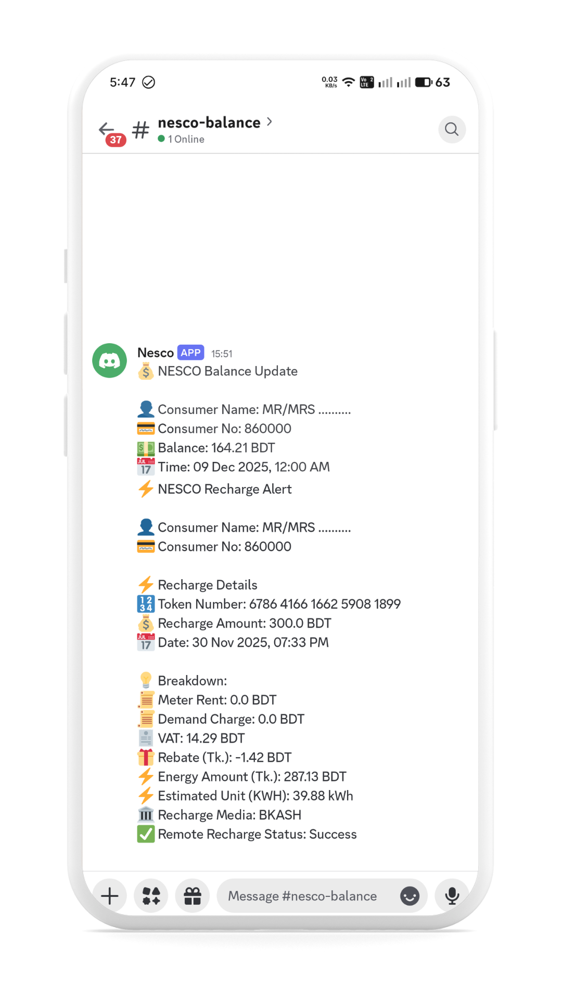
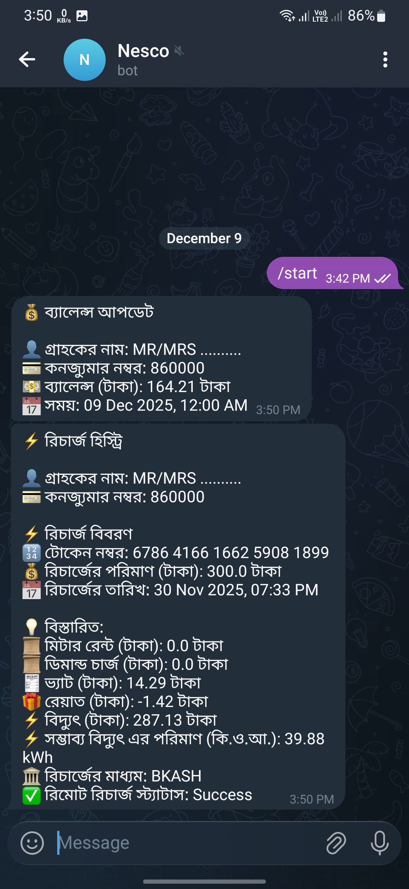
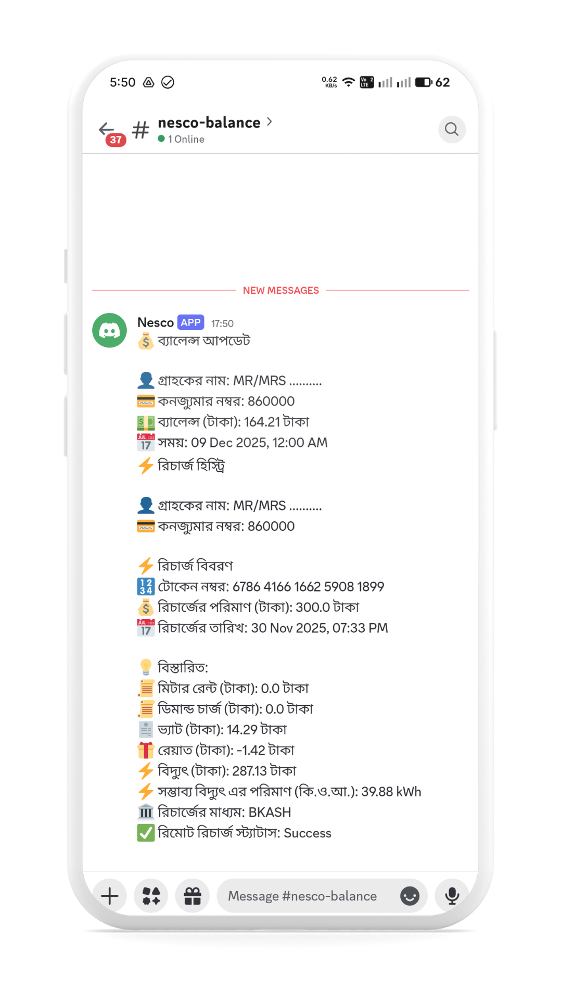

# NESCO Prepaid Balance Automation

Automatically fetch your daily balance and recharge history from the NESCO prepaid portal and send notifications to Telegram and Discord — in Bangla or English! 🇧🇩🌍

---

# 📌 About the Project

This project automates checking your NESCO prepaid meter.
It logs into the NESCO portal, retrieves:

- 🔋 Daily electricity balance

- 💳 Recharge history

And sends the results to:

- ✔️ Telegram Bot

- ✔️ Discord Bot (using bot token)

All of this runs automatically through GitHub Actions, so it works even when your PC is off!

---
## 📝 Description
This tool performs the following steps:

- Logs into the NESCO prepaid system using your Consumer Number

- Collects your current daily balance

- Collects recent recharge history

- Generates a formatted message

- Sends notifications to Telegram + Discord in your preferred language

---
## ⭐ Key Features
✨ Daily balance update

✨ Recharge history report

✨ Bangla & English message support

✨ Telegram + Discord notifications

✨ Config file for easy customization

---
## 🚀 How to Use
1️⃣ Required Library
```python
pip install requests beautifulsoup4
```


2️⃣ Clone the Repository
```bash
git clone https://github.com/rezuwan19/Nesco-Prepaid-Balance.git
cd Nesco-Prepaid-Balance
```
3️⃣ ⚙️ Configuration

Open config.py and fill in your details:
```bash
# ------------------ config.py ------------------ #

# Your 8-digit prepaid meter consumer number
NESCO_CUSTOMER_NO = "8600XXXX"

# Your name as shown in the NESCO portal
NESCO_CONSUMER_NAME = "Your Name Here"

# Telegram Bot Details
TELEGRAM_BOT_TOKEN = "YOUR_TELEGRAM_BOT_TOKEN"
TELEGRAM_CHAT_ID = "YOUR_TELEGRAM_CHAT_ID"

# Discord Bot (Token-based)
DISCORD_BOT_TOKEN = "YOUR_DISCORD_BOT_TOKEN"
DISCORD_CHANNEL_ID = "YOUR_DISCORD_CHANNEL_ID"
```
4️⃣ Choose Your Message Language

Your repo includes two main scripts:
| Script        | Language               |
| ------------- | ---------------------- |
| `main-en.py`  | English message output |
| `main-ban.py` | Bangla message output  |

✔ If you want English notifications → use main-en.py

✔ If you want Bangla notifications → use main-ban.py

5️⃣ Rename main file

- If you need English message output Rename **main-en.py to main.py**

- If you need Bangla message output Rename **main-ban.py to main.py**

6️⃣ Run one of the main files

```python
python main.py
```

---
## 📸 OutPut (Screenshots)

<p align="center" width="100%">
  
  
  
  
</p>

---

## Donate
<a href="https://coff.ee/rezuwan19">
  
</a>

---

## GitHub Actions
1️⃣ Create a new repository on GitHub

2️⃣ Upload File
- config.py
- main.py
- notifier.py

3️⃣ Add GitHub Actions
- Go to GitHub Actions page
- Click  **set up a workflow yourself**

4️⃣ Add Code
```besh
name: Nesco Balance and Recharge Check

# Allow write access to repo so workflow can commit
permissions:
  contents: write

on:
  schedule:
    # RUN every 4hour
   - cron: '0 */4 * * *'
  workflow_dispatch:

jobs:
  run-main:
    runs-on: ubuntu-latest

    steps:
      - name: Checkout repository (full history, allow pushes)
        uses: actions/checkout@v4
        with:
          fetch-depth: 0
          persist-credentials: true

      - name: Set up Python
        uses: actions/setup-python@v5
        with:
          python-version: '3.10'

      - name: Install dependencies
        run: |
          python -m pip install --upgrade pip
          pip install requests beautifulsoup4

      - name: Show current branch and HEAD (debug)
        run: |
          echo "GITHUB_REF: $GITHUB_REF"
          git branch --show-current || true
          git rev-parse --abbrev-ref HEAD || true

      - name: Ensure last_data.json exists (create if missing)
        run: |
          if [ ! -f last_data.json ]; then
            echo "{}" > last_data.json
            git add last_data.json || true
            git commit -m "Add placeholder last_data.json" || echo "no commit"
          fi

      - name: Run main.py (this should update last_data.json when new data appears)
        run: |
          python main.py

      - name: Show last_data.json and git status (debug)
        run: |
          echo "---- last_data.json content ----"
          if [ -f last_data.json ]; then
            cat last_data.json
          else
            echo "last_data.json not found"
          fi
          echo "---- git status ----"
          git status --porcelain
          git ls-files --modified || true

      - name: Commit updated last_data.json if changed
        env:
          GITHUB_TOKEN: ${{ secrets.GITHUB_TOKEN }}
        run: |
          git config user.name "github-actions[bot]"
          git config user.email "41898282+github-actions[bot]@users.noreply.github.com"

          # Stage the file
          git add last_data.json || true

          # If staged changes exist, commit and push
          if ! git diff --staged --quiet; then
            git commit -m "Update last_data.json (workflow run on $GITHUB_RUN_ID)"
            # Push to the same ref/branch the workflow triggered on
            git push origin HEAD:${{ github.ref_name }}
          else
            echo "No changes to last_data.json — nothing to commit."
          fi
```

*This code run every 4 hour Automatically*

5️⃣ Save GitHub Actions

- Click Commit changes
- Again Click Commit changes

GitHub Actions add Successfully. 

The GitHub Action will run automatically every four hours.

---
## GitHub Actions Time
✅ Every 1 hour
```yaml
on:
  schedule:
    - cron: '0 */1 * * *'
  workflow_dispatch:
```

✅ Every 2 hours
```yaml
on:
  schedule:
    - cron: '0 */2 * * *'
  workflow_dispatch:

```
✅ Every 3 hours
```yaml
on:
  schedule:
    - cron: '0 */3 * * *'
  workflow_dispatch:

```

✅ Every 4 hours
```yaml
on:
  schedule:
    - cron: '0 */4 * * *'
  workflow_dispatch:

```
✅ Every 5 hours
```yaml
on:
  schedule:
    - cron: '0 */5 * * *'
  workflow_dispatch:

```
✅ Every 6 hours
```yaml
on:
  schedule:
    - cron: '0 */6 * * *'
  workflow_dispatch:

```
